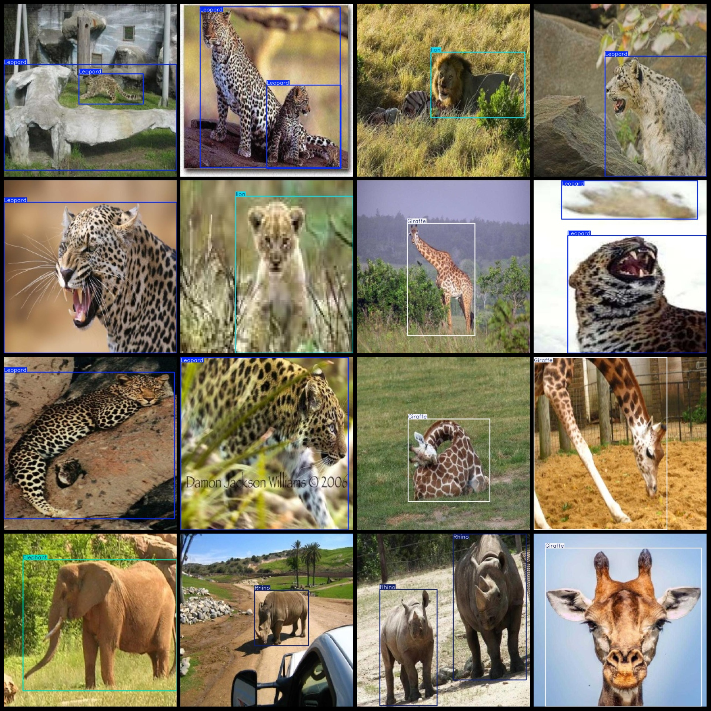
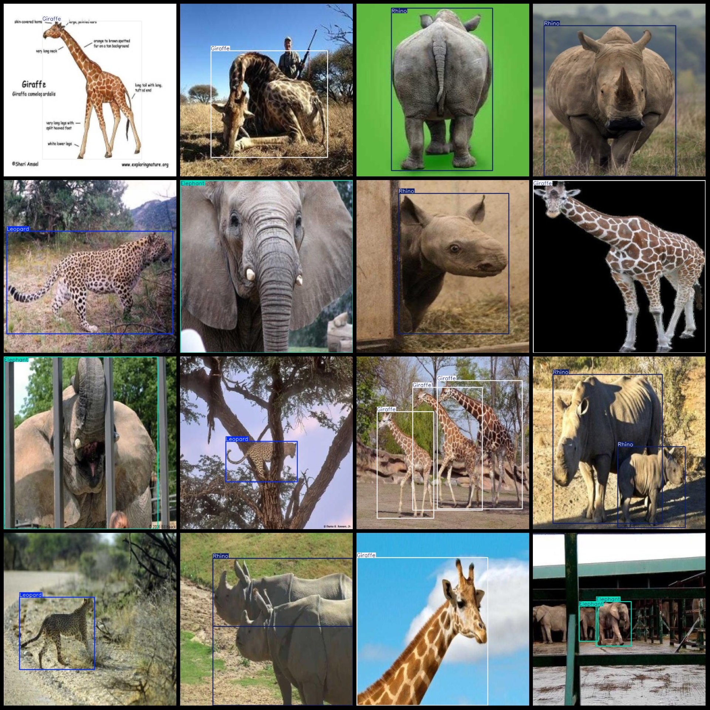

# African Animals Detection Dataset: VOC+YOLO Format, 1418 Images in 5 Classes

The dataset format is Pascal VOC format combined with YOLO format (txt file without split paths, only containing jpg images, along with corresponding VOC format xml files and YOLO format txt files).

Number of images (jpg file count): 1418
Number of annotations (xml file count): 1418
Number of annotations (txt file count): 1418
Number of annotation categories: 5
Annotation category names (note that the order of categories in YOLO format may not correspond to this, but refer to the labels folder classes.txt for consistency): ["Elephant", "Giraffe", "Leopard", 
"Rhino", "lion"]
Each category's number of bounding boxes:
- Elephant (elephant) bounding box count = 418, occupying image count = 278
- Giraffe (giraffe) bounding box count = 330, occupying image count = 254
- Leopard (leopard) bounding box count = 360, occupying image count = 296
- Rhino (rhinoceros) bounding box count = 430, occupying image count = 296
- Lion (lion) bounding box count = 410, occupying image count = 294
Total bounding box count: 1948
Image resolution: 640x640
Annotation tool used: labelImg
Annotation rules: Drawing bounding boxes for each category
Important note: The dataset does not have separate training, validation, or test sets; they need to be manually divided.
Special declaration: This dataset does not guarantee the accuracy of models trained on it or weight files.
Image preview:

## Images

Here is a pay link on Stripe ( https://buy.stripe.com/3cs8yP7sY87d0vu9AB ). Please contact me lonlonago@foxmail.com after funding $89, and I will send you a complete data files , thank you!

